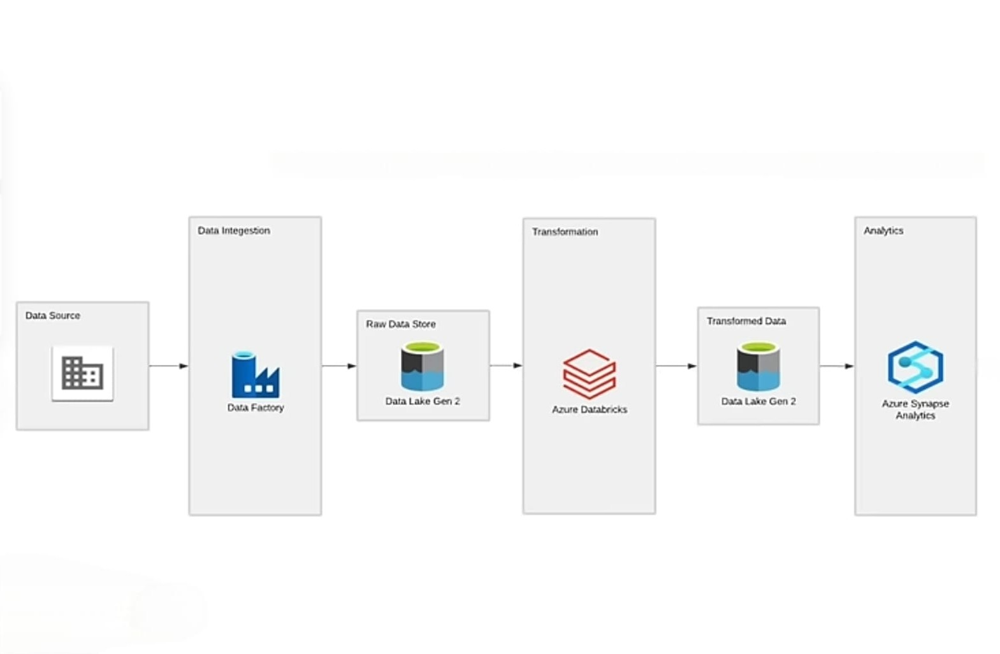

# 🏅 2021 Tokyo Olympics Data Engineering Project

## Introduction
This project demonstrates a complete Azure-based data engineering pipeline for the 2021 Tokyo Olympics dataset. The dataset contains details about athletes, medals, events, and countries that participated in the Tokyo 2021 Olympic Games.

## Architecture Diagram

## 📁 Data Flow Architecture
Data Ingestion: Dataset was manually uploaded to GitHub and fetched using Azure Data Factory.

Storage:

raw/ folder contains unprocessed files.

transformed/ folder holds cleaned and processed data.

Transformation: Data cleaned and transformed in Azure Databricks.

Serving: Synapse connects to transformed data and builds external tables and views.

## 🔧 Technologies Used
- Azure Data Factory – Manually built pipelines to ingest data from GitHub.

- Azure Data Lake Gen2 – Stores both raw and transformed data in structured folders within a single container.

- Azure Databricks – Performs data cleaning and transformation.

- Azure Synapse Analytics – Creates external tables and views using SQL for downstream access.

- Languages – Python, SQL.

## 📊 Dataset Description
This project uses the 2021 Olympics in Tokyo dataset, sourced from Kaggle. It provides detailed information about the athletes, events, medals, and countries that participated in the Tokyo 2021 Olympic Games.

The dataset includes multiple related CSV files containing:

- Athlete names, gender, nationality, and age

- Sports and events participated in

- Medal types (Gold, Silver, Bronze)

- Country-level participation and rankings

- Event-level performance statistics

This dataset is ideal for demonstrating data engineering workflows that include real-world data ingestion, transformation, and querying scenarios across multiple entities.

The data was uploaded to GitHub and accessed via HTTP using Azure Data Factory for pipeline execution.

## Data Set Link
Link : https://www.kaggle.com/datasets/arjunprasadsarkhel/2021-olympics-in-tokyo

## Project Outcome
Designed and implemented data pipeline on Azure to ingest and transform Tokyo 2021 Olympics data. Ensured clean data segregation and transformation within a structured container, enabling downstream analytics integration.
